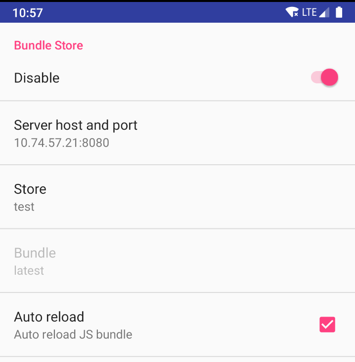

## Bundle Store

**These commands can only be used with access to an [Electrode Native bundle store server]**

Electrode Native bundle store provide features that are close to the ones offered by CodePush but more fitted to development/qa purposes. 

Similarly to CodePush, ern Bundle Store offers React Native development teams, the ability to push JS bundles that can then be dynamically retrieved and loaded by the native application.

Once a bundle store server is available, any development team or individual developer can easily create (or use existing) store(s) and push JS bundles to the server, using `ern bundlestore` commands. Then, from the native application, anyone can load any bundle from any store, through the `Electrode Native Settings` menu. 

The bundle store server keeps all bundles that have been pushed to the different stores, and all these bundles are accessible within the native app. The bundle store also supports source maps out of the box, meaning that if the loaded bundled is crashing at some point, the red screen will show the symbolicated stack trace. Bundle "time machine" and source map support can be very useful, used in conjunction, to pin point the exact location of a crash and in which bundle (which point in time) the problem was introduced.

## Configuring access to bundle store server

The url to the bundle store server should be set in cauldron root configuration (`config/default.json`) as follow :

```json
{
  "bundleStore": {
    "url": "localhost:3000" 
  }
}
```

Once done, any user connected to the Cauldron will have access to the binary store server.

### Creating a store

Creating a new store can be achieved through the [bundlestore create] command.   
The only parameter this command takes is the name of the store to create. The store name is also the unique identifier of the store, so it shouldn't already exist in the server, otherwise the command will fail.  

After creating the store, the command will log the `store access key`. The store access key is needed to upload bundles to this store. Users won't be able to upload bundles to the store without it.  
Assuming the newly created store is meant to be used by developers of a given team, the access key should be shared with the team. Any developer of the team can then start using this store and upload bundles to it.

### Using/Switching store

The [bundlestore use] command should be used to initially start using a given store or switch to a different store that the one currently in use. The only parameter it takes is the given `store access key`. Upon command completion, the `ern` local client will be set to use the store associated with the access key. From this point on, any time an `ern` command is run, it will log the name of the bundle store that it is currently using, next to the Cauldron.

```
[v0.38.0] [Cauldron: -NONE-] [BundleStore: test-store]
```

### Uploading a bundle

`ern` will upload a bundle to the store it is currently set to use (see `Using/Switiching` store above). Then the [bundlestore upload] command will take care of creating and upload a JS bundle to the active store. Please see the [bundlestore upload] command reference for additional details, as this command accept many different parameters.   

By default, both iOS and Android bundles will be created and uploaded to the server. Also, the bundles will by default be `development` bundles (`__DEV__=true`). These default can be changed through command parameters. 

Once the bundle(s) (and source map(s)) have been uploaded to the server, the command will log the `bundle id(s)`. This can be useful for tracking/debugging purposes as the `bundle id(s)` of the currently loaded bundled will also be visible in the native application. 

### Loading bundles in the native application

Bundles uploaded to a bundle store can be accessed and launched in the native application via the `Electrode Native Settings` menu (accessible through React Native developper menu).

By default, the bundle store is disabled and the bundle store server host and port is set to `localhost:3000`.

<p align="center">
  
</p>

Server host and port can be set manually, but a better way is to set it directly in the native application when initializing the Container (as seen below for Android). This way, the server host/port will ,by default, point to the server the native application is using, and it will not be needed to set it manually each time the app is installed.

```java
ElectrodeReactContainer.initialize(
            this,
            new ElectrodeReactContainer.Config()
              .bundleStoreHostPort("10.74.57.21:8080"));
```
   
Tapping the `Store` menu item will display a list of all the stores present in the server. Selecting a store from this list will then give access to all bundles that have been uploaded to this specific store. It is then possible to select a bundle to load from this store through the `Bundle` menu item. By default, the bundle to load will be set to `latest`, meaning that the latest bundle that was uploaded to the store will be loaded. It is possible to load a different bundle (not the latest one) by tapping the `Bundle` menu item and choosing a specific bundle from the list of all uploaded bundles (ordered by time).

The `Auto reload` option (turned on by default) will auto reload the bundle whenever a different bundle is selected from the list of available bundles.

Disabling the bundle store will automatically restore settings that were in use prior to enabling the store and reload the bundle. For example, if the loaded bundle was the one stored in the native application, it will reload this one. If the bundle was the one loaded from a local metro server, it will reconnect to this local server.

### Bundle Store commands reference

[bundlestore create] | Create a new store  
[bundlestore use] | Use a specific store  
[bundlestore delete] | Delete an existing store  
[bundlestore upload] | Upload a bundle to a store

[bundlestore create]: ./bundlestore/create.md
[bundlestore use]: ./bundlestore/use.md
[bundlestore delete]: ./bundlestore/delete.md
[bundlestore upload]: ./bundlestore/upload.md
[Electrode Native bundle store server]: https://github.com/electrode-io/ern-bundle-store