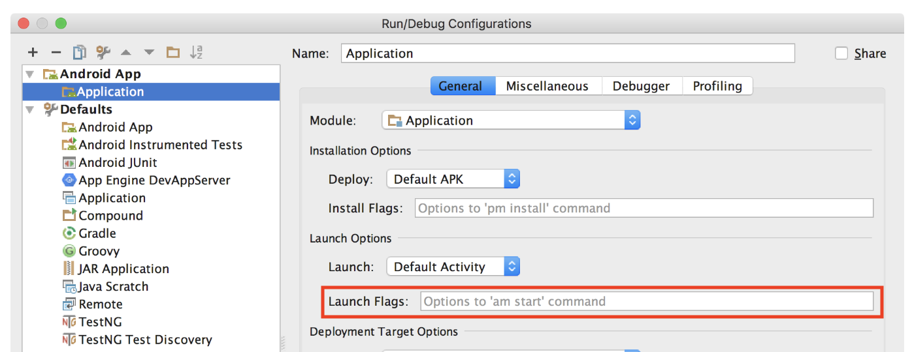

## `ern run-android`

#### Description

- Runs a MiniApp on an Android emulator or connected device

#### Syntax

`ern run-android`

**Options**

`--baseComposite <compositePath>`

- Git or File System path, to the custom Composite repository (refer to the [custom Composite] documentation for more information).

`--descriptor, -d`

- complete native application descriptor

`--dev [true|false]`

- Enable or disable React Native dev support

`--extra/-e`

- Optional extra configuration specific to local container and runner
- Override the Android build config during local container generation and runner project by passing `androidConfig` attributes
  - **As a json string**
    For example `--extra '{"androidConfig": {"androidGradlePlugin": "3.2.1","buildToolsVersion": "28.0.3","compileSdkVersion": "28","gradleDistributionVersion": "4.6","minSdkVersion": "19","sourceCompatibility": "VERSION_1_8","supportLibraryVersion": "28.0.0","targetCompatibility": "VERSION_1_8","targetSdkVersion": "28"}}'`
    Find more information on [android configuration]
  - **As a file path**
    For example `--extra /home/user/my-container-config.json`
    In that case, the configuration will be read from the file.
  - **As a Cauldron file path**
    For example `--extra cauldron://config/container/my-container-config.json`
    In that case, the configuration will be read from the file stored in Cauldron.
    For this way to work, the file must exist in Cauldron (you can add a file to the cauldron by using the [ern cauldron add file] command).
    Find more information on [configuring via cauldron]

Alternatively, it is also possible to provide this extra configuration in the `package.json` of the MiniApp, inside the `ern` object. For example:

```json
"ern": {
  "androidConfig": {
    "minSdkVersion": "19",
    "compileSdkVersion": "28"
  }
}
```
- Optional hooks to run an arbitary script before or after js bundling is possible. 
  - If a script is defined as a `preBundle` hook, it will be executed after the composite generation, prior to running metro bundler, from the directory containing the generated composite project. 
    - **As a json string**
      `--extra '{"containerGenerator": {"hooks": {"preBundle": "/workspace/ern/picking-miniapp/script/pre-script.sh"}}}'`
    - **As a file path**
      `--extra <path>/container-config.json`
    - **As a Cauldron file path**
      `--extra cauldron://config/config.json`
  - If a script is defined as a `postBundle` hook, it will be executed just after metro bundler has been run, from the directory containing the bundle.
    - **As a json string**
      `--extra '{"containerGenerator": {"hooks": {"postBundle": "/workspace/ern/picking-miniapp/script/post-script.sh"}}}'`
    - **As a file path**
      `--extra <path>/container-config.json`
    - **As a Cauldron file path**
      `--extra cauldron://config/config.json`

Program to use to run the script should be indicated using [shebang pattern][1] in the script itself as first line.

`--host`

- Host or ip to launch the local packager on _(default: localhost)_

`--launchFlags <string>`

- Extra options passed to `am start` command when launching the application (correspond to the `Launch Flags` in Run/Debug Configurations of application in Android Studio, as can be seen on screenshot below)
- Make sure to use `=` on the command line to provide this option, and keep the string in quotes. For example `--launchFlags="--es aKey aStringValue --ei anotherKey 1"`



`--mainMiniAppName`

- Name of the MiniApp to launch when starting the Runner application
- If you are running the command from the `MainApp` directory, only specify name of the `MiniApp` (Not the path).

`--miniapps/m`

- One or more MiniApps to combine in the Runner Container

`--port`

- Port on which the local packager should listen on _(default: 8081)_

`--usePreviousDevice/-u`

- Use the previously selected device to avoid prompt

#### JavaScript engine

By default Electrode Native will run the MiniApp with a Container that uses JavaScriptCore engine. If you'd rather like to run the MiniApp with [Hermes](https://hermesengine.dev) engine, you should add the following inside the `ern` object of the MiniApp package.json :

```json
{
  "androidConfig": {
    "jsEngine": "hermes"
  }
}
```

#### Remarks

- You can launch the MiniApp located in the current working directory or on a connected Android device or running emulator if available. If a connected Android device is not available, the command prompts you to select an emulator to launch from the list of installed emulator images.
- The first time you run this command from within a MiniApp directory, it generates an Android directory containing the Android runner application project. If the Android folder already exists (it is not the first run of the `ern run-android` command for this MiniApp), the existing runner project is used.
- After the runner project is generated, you can safely make native code modifications to it, knowing that the next time the `ern run-android` command is issued, the project and your changes will remain.
- If you want to regenerate the runner project from scratch, remove the Android directory.
- The miniapp can be any Yarn package descriptor, including Git or other file system path schemes.
- The `ern run-android` command is the `ern` equivalent of the `react-native run-android` command.
- If you are running the command from the `MainApp` directory, only specify name of the `MiniApp` (Not the path) in the `--mainMiniAppName` option.

[custom composite]: ./platform-parts/composite/index.md
[android configuration]: ./plaform-parts/container-integration.md
[configuring via cauldron]: ./plaform-parts/container-integration.md
[1]: https://en.wikipedia.org/wiki/Shebang_(Unix)
