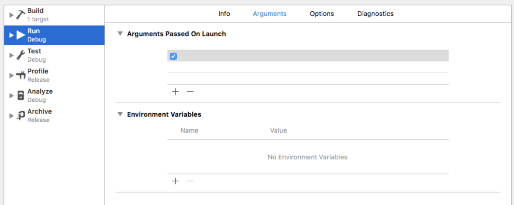

## `ern run-ios`

#### Description

- Runs a MiniApp on an iOS simulator or connected device

#### Syntax

`ern run-ios`

**Options**

`--baseComposite <compositePath>`

- Git or File System path, to the custom Composite repository (refer to the [custom Composite] documentation for more information).

`--descriptor, -d`

- complete native application descriptor

`--dev [true|false]`

`--extra/-e`

- Optional extra configuration specific to local container and runner
- Override iOS configuration during local container generation and runner project by passing `iosConfig` attributes
  - **As a json string**
    For example `--extra '{"iosConfig": {"deploymentTarget": "11.0"}}'`
    Find more information on [iOS configuration]
  - **As a file path**
    For example `--extra /home/user/my-container-config.json`
    In that case, the configuration will be read from the file.
  - **As a Cauldron file path**
    For example `--extra cauldron://config/container/my-container-config.json`
    In that case, the configuration will be read from the file stored in Cauldron.
    For this way to work, the file must exist in Cauldron (you can add a file to the cauldron by using the [ern cauldron add file] command).
    Find more information on [configuring via cauldron]

Alternatively, it is also possible to provide this extra configuration in the `package.json` of the MiniApp, inside the `ern` object. For example:
```json
"ern": {
  "iosConfig": {
    "deploymentTarget": "11.0"
  }
}
```

- Optional hooks to run an arbitary script before or after js bundling is possible. 
  - If a script is defined as a `preBundle` hook, it will be executed after the composite generation, prior to running metro bundler, from the directory containing the generated composite project. 
    - **As a json string**
      `--extra '{"containerGenerator": {"hooks": {"preBundle": "/workspace/ern/picking-miniapp/script/pre-script.sh"}}}'`
    - **As a file path**
      `--extra <path>/container-config.json`
    - **As a Cauldron file path**
      `--extra cauldron://config/config.json`
  - If a script is defined as a `postBundle` hook, it will be executed just after metro bundler has been run, from the directory containing the bundle.
    - **As a json string**
      `--extra '{"containerGenerator": {"hooks": {"postBundle": "/workspace/ern/picking-miniapp/script/post-script.sh"}}}'`
    - **As a file path**
      `--extra <path>/container-config.json`
    - **As a Cauldron file path**
      `--extra cauldron://config/config.json`

Program to use to run the script should be indicated using [shebang pattern][1] in the script itself as first line.

- Enable or disable React Native dev support

`--host`

- Host or ip to launch the local packager on.
- By default it will use the IP address that is returned by the `ipconfig getifaddr en0` command, and fallback to `localhost` in the case the command fails.

`--launchArgs`

- Arguments to pass to the application when launching it (correspond to the `Arguments Passed On Launch` in application scheme run config in Xcode as can be seen on screenshot below).
- Make sure to use `=` on the command line to provide this option, and keep the string in quotes. For example `--launchArgs="-ArgA -ArgB"`

`--launchEnvVars`

- Environment variables to pass to the application when launching it (correspond to the `Environment Variables` in application scheme run config in Xcode as can be seen on screenshot below).
- Make sure to use `=` on the command line to provide this option, and keep the string in quotes. The string should contain `key=value` pairs delimited by spaces. For example `--launchEnvVars="aKey=aValue anotherKey=anotherValue"`



`--mainMiniAppName`

- Name of the MiniApp to launch when starting the Runner application

`--miniapps/m`

- One or more MiniApps to combine in the Runner Container

`--port`

- Port on which the local packager should listen on _(default: 8081)_

`--usePreviousDevice/-u`

- Use the previously selected device to avoid prompt

#### Remarks

- You can launch the MiniApp located in the current working directory or on a connected iOS device or running emulator if available. If a connected iOS device is not available, the command prompts you to select an emulator to launch from the list of installed emulator images.
- The first time you run this command from within a MiniApp directory, it generates an iOS directory containing the iOS Runner application project. If the iOS folder already exists (it is not the first run of the `ern run-ios` command for this MiniApp), the existing runner project is used.
- After the runner project is generated, you can safely make native code modifications to it, knowing that the next time the `ern run-ios` command is issued, the project and your changes will remain.
- If you want to regenerate the runner project from scratch, remove the iOS directory.
- The miniapp can be any Yarn package descriptor, including Git or other file system path schemes.
- The `ern run-ios` command is the `ern` equivalent of the `react-native run-ios` command.

[custom composite]: ./platform-parts/composite/index.md
[iOS configuration]: ./plaform-parts/container-integration.md
[configuring via cauldron]: ./plaform-parts/container-integration.md
[1]: https://en.wikipedia.org/wiki/Shebang_(Unix)
