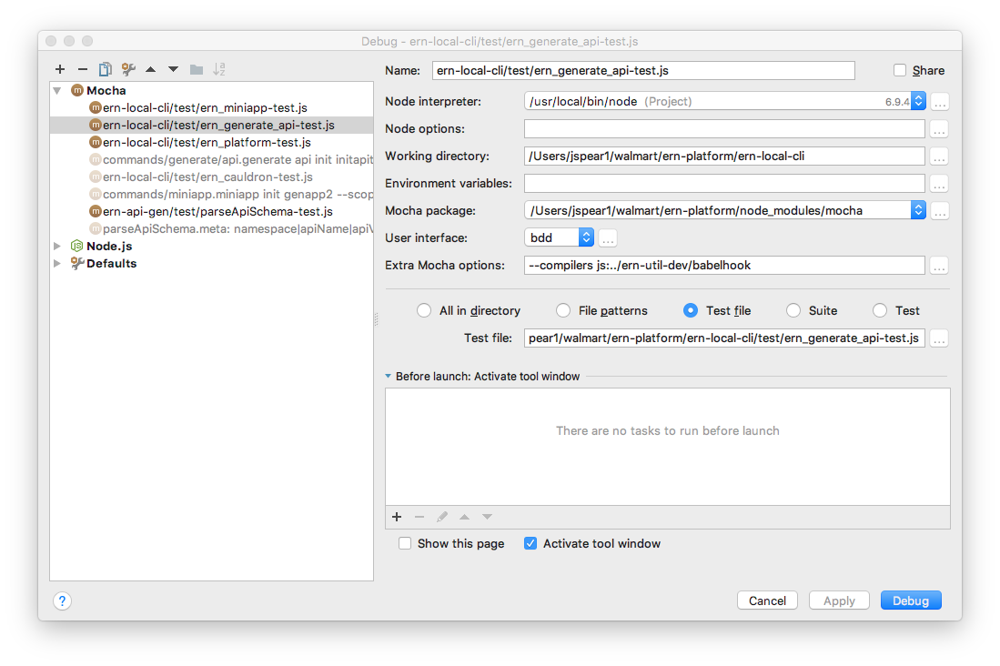

Writing and Running Test
===
ERN tests take a bit of plumbing, there are a few examples in ern-local-cli.
We use mocha to run the tests, babel to transpile them and chai for assertions.

## Adding tests to your project.
To add tests to you project, ensure you have ern-util-dev as a dev dependency
```bash
$ npm i ern-util-dev --save-dev

```

and add a test script to package.json

```json
{
  "name": "@walmart/Your Project",
  "version": "0.0.1",
  "scripts": {
    "test": "ern-mocha",
    ...
  },
  ...,
  "devDependencies": {
    "@walmart/ern-util-dev": "0.0.1",
     ...
  }
  
}


```

## Running tests CLI
To run tests from the command line

```bash
$ cd your_project
$ npm run test
```
Or without package.json
```bash
$ cd your_project
$ ./node_modules/.bin/ern-mocha
```

### Running tests Webstorm
Open web storm and configure like 



Then run

## Writing Tests
Tests are written using [mocha](https://mochajs.org), [chai](chaijs.com) and [babel](https://babeljs.io/) (so you can use es6)
The are run with a tool that combines them all that should be in your ./node_modules/.bin/ern-mocha


```es6
import {assert, expect} from 'chai';
import yourcode from '../src/yourcode';

describe('yourcode', function(){
  
  it('should do something', function()P{
  
  });

});

```

### ERN Specific tests.
To test the command line there is some special support in ./ern-local-cli/test/suppport.
To use it you need to hook into your before and after.  This creates and removes a tempdirectory
your the commands run in.

'@walmart/ern-util-dev' returns an object with the following function
``` 
 
├── runBefore 
│   └── Use to setup the temp directory.
├── runAfter 
│   └── Use to setup the delete temp directory
├── ern
│   └── Takes a command and returns a function, that when excuted returns a promise that returns an error or an object with stderr and stdout.
├── ernTest,
│   └── Takes a command FROM THE NAME OF THE TEST and returns a function, that when excuted returns a promise that returns an error or an object with stderr and stdout.
├── gradle
│   └── Takes a command and returns a function, that when excuted returns a promise that returns an error or an object with stderr and stdout.
├── compare
│   └── Takes a directory and an optional function that filters out matches, to compare the temp filesystem to the matching directory
├──  exists
│   └── Returns a function that when invoked asserts a file exists.
├── json,
│   └── Takes a filename, and an optional example object, Returns a function that when invoked asserts a file exists and that it has the properties.
└── fail
      └── Takes a message and returns a function, when invoked will assert failure. Use to test cases that should not happen.

```

An example
```javascript
import ernSupport from '@walmart/ern-util-dev';

describe('commands/cauldron', function () {

    this.timeout(100000);
    /**
    * ernSupport sets up a temp directory to exectue other tests in.
     * The 
    
    
    
*/
    const {
        runBefore,
        runAfter,
        ernTest, fail
    } = ernSupport(__dirname);

    before(runBefore);
    //same as running ```$ ern cauldron```
    it(`cauldron`, ernTest().then(fail, function ({err, stdout, stderr}) {
        /cauldron needs a command/.test(stderr);
    }));
    after(runAfter);


});


```


