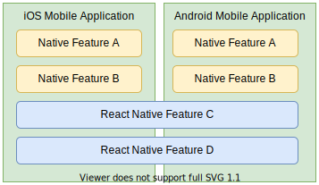

## What is Electrode Native ?

Electrode Native is a mobile platform, composed of a set of tools, facilitating the integration and delivery of features written in React Native into existing non React Native iOS/Android applications.

The core of Electrode Native platform is written in TypeScript. Some parts also contain native code in the form of [Mustache](https://mustache.github.io/) templates used for native code generation. Some modules of Electrode Native are mainly native projects, such as the [Electrode Native Bridge] being a React Native native module.

Interaction with Electrode Native will mostly be done through the `ern` command line client.

 

 

## Why Electrode Native ?

Electrode Native was created to answer the challenges of pluging React Native components in an existing native application code base. Tackling this manually, from scratch, is possible, but is unfortunately minimally documented. Moreover, dealing with this problem is an way that is as univasive as possible for the existing native application, is even more challeging.

Electrode Native takes on those challenges by providing an open source platform that reduces the friction for both React Native developers and mobile application developers. Using the Electrode Native platform, developers can use their knowledge without having to drastically change their workflow to accommodate the integration of multiple React Native components in their mobile application(s).

React Native allows JavaScript developers to leverage their knowledge of React / React Native and to use a single JavaScript code base to develop mobile applications targeting multiple platforms. React Native also give developers the power to transparently update their code as over the air (OTA) updates without having to go through the standard store release process and delays-not to mention actual adoption of updates by the users.

React Native can (seemingly) also be used to build and reuse some components written in React Native--and "plug" them into existing mobile applications. However, this capability is not yet widely adopted--primarily due to the friction of the required infrastructural changes as well as the absence of adequate tooling--either within the React Native platform itself or as third party tools to effectively help deal with this use case.
The learning curve and investment required for mobile application developers who are working on a solution that actually works well for their mobile application, is often too much for many developers and development teams.

There are few solutions to this integration challenge and those that are available are not well documented enough-- most require additional tooling as well as infrastructure changes such as switching the mobile code base to a monorepo.

Electrode Native includes a well developed set of open source custom tools that successfully addresses this challenge.

Electrode Native allows JavaScript developers to work on their own React Native based components, called MiniApps--from within their dedicated repository, using their own release lifecycle. The MiniApps can be published and reused within potentially any mobile application. Existing JavaScript React Native developers will experience little change to their workflow.

Electrode Native allows Mobile application developers to easily integrate individual React Native components within their existing mobile application--without changes to their infrastructure or the need to deal with or install any JavaScript based tools--not even Electrode Native itself!

Electrode Native provides mobile application developers a single third-party library known as the "Electrode Native Container". The container includes all their MiniApps and developers interact with it as they would with any other third-party native library. If you need to update a MiniApp version or add new MiniApps to your container, all it takes is triggering a new container generation and publication. Developers only need to update the container version that is to be used within their mobile application.

The bottom line: Using Electrode Native, developers can concentrate on functionality and building their apps--without the hassles of reuse or integration issues.

### Electrode Native CLI (ern)

The Electrode Native (`ern`) CLI is a command line client containing commands that developers / devops, will use to work with the Electrode Native platform and generate artifacts that can be consumed by the mobile application. Some commands are similar to React Native commands. For example, instead of using the `react-native start` command, Electrode Native exposes the `ern start` command.\
For more information about using the Electrode Native CLI commands, refer to the Electrode Native CLI documentation.

[Learn More about the CLI](../platform-parts/cli/index.md)

### Electrode Native Bridge

The Electrode Native bridge is a cross-platform, low-level bi-directional communication library used to simplify communication between JavaScript and the native mobile application code. It is not part of the Electrode Native platform itself. The [Electrode Native bridge] is actually a React Native native module.

Even though the Electrode Native bridge is a standalone native module that can be used in any React Native projects _(even non Electrode Native based)_, if you are using Electrode Native, you won't have to directly interact with it in your MiniApps or in your mobile applications. Instead, you'll use Electrode Native APIs, that can be generated from a Swagger schema and will generate the code that you would have to write were you using the bridge directly.

[Learn More about the Bridge](../platform-parts/bridge/index.md)

### APIs

At some point you'll need one or more React Native features to interact with your mobile application, to access data or to trigger an action. Or, your mobile application may need to interact with your MiniApps. That's where Electrode Native APIs come into play.

Powered by the [Electrode Native Bridge] and automatically generated by Electrode Native from a Swagger schema of your own, Electrode Native APIs provide clearly defined methods of communication between the native Android or iOS application and the JavaScript side.

[Learn More about the APIs](../platform-parts/apis/index.md)

### Container

The Electrode Native container is a native library similar to common third-party libraries that Android and iOS developers are familiar with. The container is generated entirely by the Electrode Native platform and packaged as an Android (AAR) library for Android and as a Framework for iOS.

The container includes Electrode Native engine initialization code as well as all the JavaScript React Native MiniApps that you want to include in your mobile application, along with all their native dependencies and assets.

Each mobile application will have its own custom Electrode Native container.

[Learn More about the Container](../platform-parts/container/index.md)

### Cauldron

A Cauldron is a centralized document database that is used to store information about mobile application versions, native dependencies, and information about MiniApps. There is one Cauldron per mobile application. With appropriate permissions, you can use the Electrode Native CLI commands to access and modify the data stored in a Cauldron.

Setting up a cauldron boils down to creating a Git repository. To host your cauldron, you can use any provider offering Git repository storage. GitHub, GitLab and Bitbucket are some of the most popular providers. In our documentation, we refer to GitHub but you are free to use the provider of your choice.

[Learn More about the Cauldron](../platform-parts/cauldron/index.md)

### Manifest

While the Electrode Native cauldron makes sure that no misaligned or non-supported native dependency version makes it into your mobile application--the Electrode Native manifest is used to align native dependency versions across multiple MiniApps in the first place.

The Electrode Native platform stores its master manifest in a GitHub repository. The master manifest is public and open sourced so that anyone can add native dependency support. By default, Electrode Native relies on the master manifest. For more advanced use cases, it is possible to override the master manifest with your own.

[Learn More about the Manifest](../platform-parts/manifest/index.md)

### Runner

The Electrode Native platform contains two runners, one for each mobile platform (Android and iOS). Both runners are very simple and light-weight mobile applications--similar to new application projects in Android Studio or Xcode.

The Electrode Native runner application is used to run your MiniApp standalone so that you can effectively develop, debug, and test your MiniApp--before releasing a new or updated version of the MiniApp.

An Electrode Native runner application is automatically generated the first time you use the Electrode Native `ern run-ios` or `ern run-android` commands for your MiniApp. Relative to your MiniApp root directory, the runner application is generated in new Android and iOS directories.

[Learn More about the Runner](../platform-parts/runner/index.md)

[electrode native bridge]: https://github.com/electrode-io/react-native-electrode-bridge
