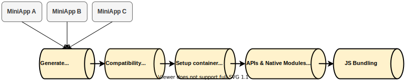

A container can either be `explicitly` or `implicitly` generated.

The only way to `explicitly` generate a container is to use the `create-container` command.\
On the other hand, a container will be `implicitly` generated whenever running some `cauldron` sub-commands such as `regen-container` or `add miniapps` _(and many other ones)_.

To be generated, what the container mostly need is a non empty set of miniapp(s) that may come from different locations _(local directory, npm, git repository)_.

Container generation goes through multiple steps in sequence, starting with composite generation, as illustrated below

 

 

## Composite Generation

The first step of container generation is actually to generate a composite project. Composite and composite generation is covered in a dedicated section of the documentation, but in a nutshell, the composite is a just a JavaScript project with miniapps as dependencies, and a single top level entry point that is just importing each of the miniapps. Electrode Native runs metro bundler on this composite project to create the final JS bundle.

## Compatibility Checks

After generating the composite project, Electrode Native will identify all native depencies _(APIs and native modules)_ packages present in the composite and will perform compatibility checks to make sure that there is only one clear identified unique version of each native dependency. For example, if MiniApp A and B both use react-native-maps native module but with a different version, this step would fail.

## Setting up container template

This step is actually relatively straightforward. It just takes care of copying the container project template to the directory where the container will be generated _(output directory)_.

## Injecting native dependencies

This step is responsible for injecting all the native code into the container. The process is a bit different for Android compared to iOS.\
For Android, all the APIs, APIs native implementations and native modules code are injected into the container. This is because all of these components are not published to Maven, so can't be retrieved as regular maven dependencies in the build.gradle of the container.\
This is also the reason why a plugin configuration is needed in manifest for native modules, to let Electrode Native where the code of the nativem module is in, and what exactly to inject in the container.\
For iOS, thanks to CocoaPods injection _(starting with RN 61)_, we don't have to manually inject the code of native modules in the iOS container, but rather rely on CocoaPods, very similar to the auto linking mechanism used by React Native. This is also why iOS plugin configuration in manifest is relatively minimal, as the podspec of the native module takes the role of the plugin configuration.

## JS Bundling

Finally, Electrode Native will run Facebook Metro Bundler on the composite project, to generate the final JS bundle. The bundle output location passed to metro will be the correct target location in the container. The assets output path will also point to the right directory in the container, so that assets are properly injected in the container.

Once this process is completed, the generated container project will be accessible in the output directory. It can then be imported as-is in the client application, or can be further processed using container `transformers` and/or published using container `publishers`.
