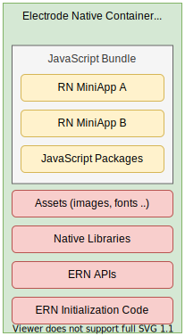

A container is the end product of Electrode Native.

It is a native library, in the form of an AAR library for Android, and a Framework for iOS.\
It is composed of a single miniapp or a set of miniapps, and includes all of their supporting assets and dependencies _(JS and native)_.

The mobile application will only have to depend/interact with a single container library, as it encapsulates eveything that is needed to launch the miniapps. This is an important point, so let us emphasize it again.

 **A mobile application will _(and can)_ only depend on a single container. Composition of miniapps and container customization takes place at the container generation level to tailor a container to a specific target mobile application.**

 Here is a high level diagram, giving a better idea of what's inside a container, along with some additional details.

 

 

- **JavaScript Bundle**\
The JavaScript bundle is a single file, containing the JavaScript code of all the miniapps part of the container. It also includes all of the JavaScript dependencies _(packages)_ that the miniapps depends on. This bundle is generated by Facebook Metro bundler, the default bundler used for packaging React Native applications.\
Electrode Native offers to package multiple miniapps, coming from different sources, in a single bundle. To achieve this, during container generation, Electrode Native will create a temporary JS project _(ERN composite)_ that will include all the required miniapps. It will then run metro bundler on this intermediate composite project.

- **Assets**\
Represents all of the images, fonts and other assets that are used by the MiniApps.\
As in React Native projects, assets are not part of the JS bundle but are instead stored in the native project itself _(assets directory for Android, Resources for iOS)_.\
Also, as in React Native projects, Electrode Native relies on Metro bundler to generate the target file structure for the assets.

- **Native Libraries**\
All of the native libraries that are used by the miniapps.\
This includes React Native _(obviously)_ along with all its native dependencies, but also the native code of all of the native modules that are being used by the miniapps.

- **ERN APIs**\
Represents all of the native code of any generated ERN API, as well as any ERN API standalone native implementation, that are being used by the miniapps.

- **ERN Initialization Code**\
Native Code that is exposed to mobile application to integrate a container.\
Mostly consist of initialization code, along with some utility code to interact with the miniapps.
