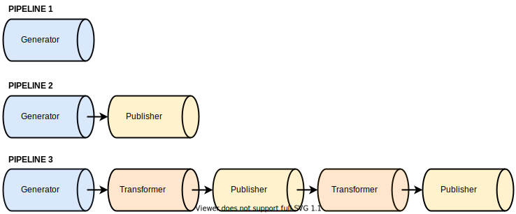

After being generated, a container can go through a sequence of steps to either alter it in some way and/or publish it to some location. This process can be conceptualized as a pipeline.

Electrode Native expose two main building blocks for building pipelines : `transformers` and `publishers`. A pipeline can be composed of any number of these building blocks, in any order, as illustrated below.

<br>
<center>

</center>
<br>

In this illustration, the first pipeline is the most basic one. It's actually an empty pipeline. Once the container is generated, it doesn't go through any further processing steps.

The second example illustrates a pipeline composed of a single `publisher` block, while the last pipeline intertwines multiple `transformers` and `publishers`.

`transformers` can be used to alter the container in some way _(resulting in changes in the generated container structure and/or files)_, while `publishers` are used to publish the locally generated container as-is to a specific location. `transformers` and `publishers` blocks are not shipped with Electrode Native, they are independent npm packages, and are dynamically installed and loaded on demand.\
The `transformers` and `publishers` blocks are further detailed in dedicated sections of the documentation.

Electrode Native offers three different ways to run a full pipeline, starting from container generation. Choosing one way or another depends of your project specifics and the envisionned overall workflow. Here are the three different approaches to execute `pipeline 3` depicted above :

**Manually sequencing ern commands**

Electrode Native CLI expose the `create-container` command to generate a container given a set of miniapps. It alos exposes the `transform-container` command to execute a transformer on a pre-generated container, and the `publish-container` command to run a publisher.\
Therefore, it is possible to sequence these commands to create a pipeline. To reproduce `piepline 3` above, you would for example run the following commands in order

- `create-container`
- `transform-container`
- `publish-container`
- `transform-container`
- `publish-container`

Any publisher or transformer extra configuration should be passed to the commands via the `--extra` option.

**Using a pipeline configuration**

Another way to run a pipeline, is to create a pipeline configuration represented in JSON.\
This configuration can then either be stored locally to the project, or in an Electrode Native cauldron.\
A `pipeline` configuration object is part of a `containerGenerator` configuration.

```json
{
  "containerGenerator": {
    "pipeline": [
      { "name": "transformer-a" },
      { "name": "publisher-b" },
      { "name": "transformer-c" },
      { "name": "publisher-d" }
    ]
  }
}
```

The `name` property should reference a real publisher/transformer npm package. Here, just for illustration purposes we don't use real ones. Also, apart from the `name` property, all transformers and publishers expose an `extra` property to provide configuration pertaining to the specific publisher/transformer. So in reality, the JSON configuration file will be more beefy than the one above.

Once this configuration is created and accessible locally or stored in a cauldron, the following commands can be run in sequence:

- `create-container` _(to generate the container)_
- `run-container-pipeline` _(to run transformers/publishers pipeline on the container)_

**Using a cauldron**

The last way to run a container pipeline with a single command, is to rely on a cauldron.
As for the pipeline configuration approach detailed above, a configuration file have to be stored in the cauldron, to configure not only the pipeline, but also the container generator _(within the `containerGenerator` object)_. Once done, a single command can be used to generate the container and run the pipeline :

- `cauldron regen-container`

This command will take care of first generating the container using the configuration stored in the cauldron _(in the `containerGenerator` object, which also includes the `pipeline` configuration)_ and will then run each steps of the pipeline.

The main difference between this approach compared to the other ones, is that using this command will target a specific application descriptor in cauldron, and will refresh the metadata associated to this descriptor in the cauldron _(think of it as a database update, updating any information that may have changed between this newly generated container and the previous one)_.\
The two previous approaches will not update anything in cauldron. They will just do their job locally and not deal with cauldron at all _(apart from optionally pulling configuration from cauldron in second approach)_.
