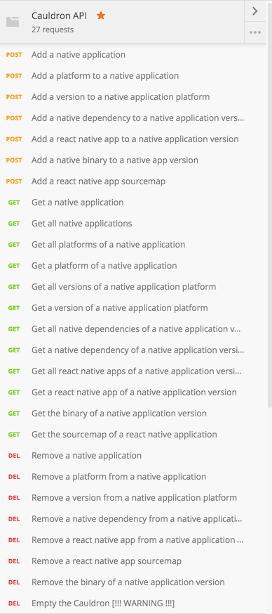

# Postman Collection

Exported collection of Postman requests covering the whole current Cauldron API surface.  
Just import it in Postman and play around !  

Reference screenshot reflecting the current collection :

